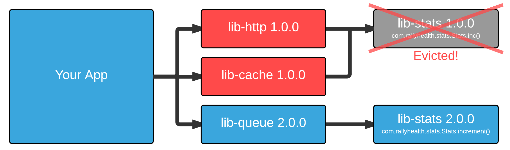
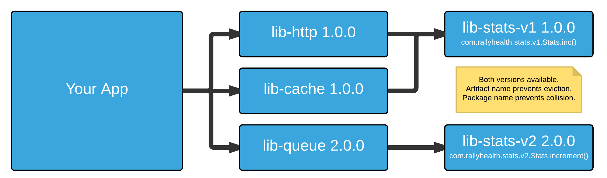
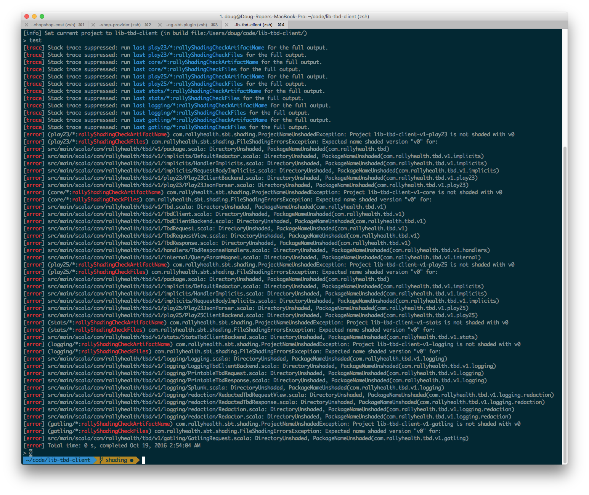

# sbt-shading

Enforces that a library's components are all versioned.

#### For example:
| What | Incorrect | Correct |
| --- | --- | --- |
| Artifact name | lib-stats | lib-stats-__v2__ |
| Packages | com.rallyhealth.stats.Stats | com.rallyhealth.stats.__v2__.Stats |
| Directories | com/rallyhealth/stats/Stats | com/rallyhealth/stats/__v2__/Stats |

Mitigates runtime dependency hell by enabling multiple incompatible major versions of a library to coexist together safely.

## Setup
Add the latest [release](https://github.com/AudaxHealthInc/sbt-shading/releases) to your plugins.sbt:

plugins.sbt
```
addSbtPlugin("com.rallyhealth.sbt" %% "sbt-shading" % "x.y.z")
```

build.sbt
```
lazy val `lib-stats` = project
  .enablePlugins(ShadingPlugin)
```

Add `v2` to your packages:

| Incorrect | Correct
| --- | --- |
| src/__main__/scala/com/rallyhealth/foo/... | src/__main__/scala/com/rallyhealth/foo/__v2__... |
| src/__test__/scala/com/rallyhealth/foo/... | src/__test__/scala/com/rallyhealth/foo/__v2__... |
| src/__it__/scala/com/rallyhealth/foo/...   | src/__it__/scala/com/rallyhealth/foo/__v2__... |

## Usage
Shading is checked automatically during the following SBT tasks
* publish
* test

Shading is not checked during `compile` because it does not affect compilation: your code
should compile fine whether it is shaded or not. Shading is a correctness test (like unit
tests).

If you want to check shading yourself you can run
```
sbt> shadingCheck
```
or
```
$ sbt shadingCheck
```


When the plugin detects a violation it will print something like this:
```
sbt> shadingCheck
[trace] Stack trace suppressed: run last <project>/*:shadingCheckFiles for the full output.
[error] (<project>/*:shadingCheckFiles) com.rallyhealth.sbt.shading.FileShadingErrorsException: Expected name shaded version "v2" for:
[error] src/main/scala/com/rallyhealth/foo/Foo.scala: DirectoryUnshaded, PackageNameUnshaded(com.rallyhealth.foo)
[error] src/main/scala/com/rallyhealth/foo/Bar.scala: DirectoryUnshaded, PackageNameUnshaded(com.rallyhealth.foo)
[error] Total time: 1 s, completed Jul 26, 2018 10:04:47 AM
```

## Depending on shaded libraries

If you are _depending_ on a shaded library you simply need to add the "v2" to the _artifact name_ of your `ModuleID` declaration:
```
"com.rallyhealth.foo" %% "lib-stats-v2" % "2.0.0"
```

To avoid repeating the version in two places -- the artifact and version -- you can use a handy implicit:
```
import com.rallyhealth.sbt.shading.ShadingImplicits._

"com.rallyhealth.foo" %% "lib-stats" % "2.0.0" shaded
```


## Why Semver is not enough
[SemVer](http://semver.org/) alone will not save you from [Dependency Hell](https://en.wikipedia.org/wiki/Dependency_hell).  

### Major versions bring breaking changes.
> 8. Major version X (X.y.z | X > 0) MUST be incremented if any backwards incompatible changes are introduced to the public API.
>
> -- <cite>http://semver.org/#spec-item-8</cite>

## A Song of Dependencies and Hell
### Chapter 1: Everything works

Consider a library, `lib-stats % 1.0.0`, that records metrics. It has a `com.rallyhealth.stats.Stats.inc()` method that everybody loves. Your app uses `lib-http`, `lib-queue`, and `lib-akka` which make use of `lib-stats % 1.0.0` to send metrics, and life is good.


### Chapter 2: The breaking change

1. One day, a well-meaning developer decides that `Stats.inc()` should really be renamed to `Stats.increment()`.
1. He renames the method and releases `lib-stats 2.0.0` as a major83 version, signaling the breaking change. He also updates `lib-queue` to make use of it and releases `2.0.0` of that as well.
1. You need the latest queue-y goodness for a new feature due tomorrow, so you update to the latest `lib-queue`. Your code compiles. Your unit tests pass. You deploy it to dev.
1. You're shocked to discover that both HTTP and Caching are broken.



You post the error to the Engineering room. They say "hurr hurr derpendencies," and tell you you'll have to clean up the mess. You need to ship this feature tomorrow. You cry.

#### Evictions
So what happened?

1. Sbt evicted `lib-stats 1.0.0` in favor of the newer `lib-stats 2.0.0`. That's by design. Sbt will only keep the latest version of a library.
1. `lib-http` tried to call `Stats.inc()` but there was no such method defined. There was only `Stats.increment()`.
1. You look up who renamed the method, but immediately regret doing so as impure thoughts flood your mind.

There must be a better way.

### Chapter 3: A Solution Emerges
#### Eliminating Evictions
Can we prevent the eviction from happening? Yes! If we give the artifacts different names, they won't get evicted. Including the major version in the name, like `lib-stats-v2`, would do the trick quite nicely. This plugin enforces that.

#### Preventing Namespace Conflicts
So if both `lib-stats-v1` and `lib-stats-v2` are on the classpath, how do we keep them from having incompatible versions of `com.rallyhealth.stats.Stats`?

Simple. This plugin enforces that you include `v2` in the package name. You'll end up with `com.rallyhealth.stats.v1.Stats` and `com.rallyhealth.stats.v2.Stats` living in harmony.



### Epilogue
Your app uses only shaded internal libraries now.  You have two binary-incompatible versions of `lib-stats-v*` in your app, but you don't care. Everything works just fine.

One day you'll update `lib-http` and `lib-cache` to use the new `lib-stats-v2`, but not today. Your friends are heading to the bar, and you're free to join then.

Your phone vibrates and you see the !love from QA and your product owner telling you how wonderful you are.

You smile as you sip your gin and tonic. Dependency hell is the last thing on your mind.

## Errors
If the artifact name, directories, or package names do not include the current major version, the [shading checks](https://github.com/AudaxHealthInc/sbt-shading/blob/master/src/main/scala/com/rallyhealth/sbt/shading/ShadingPlugin.scala#L22-L28) will fail the build when `test` or `publish` are run.



## Caveats

### Renaming
To upgrade from `lib-stats-v1` to `lib-stats-v2`, all classes that `import com.rallyhealth.stats.v1.Stats` will have to be updated to `import com.rallyhealth.stats.v2.Stats`.

This may seem like a drawback at first, but it's actually a strength. Introducing breaking changes has become more expensive. They can often be avoided. There's incentive to do so now.

### Third party jars
This plugin cannot protect you from unshaded third party libraries. For example, netty 3 does not play nicely with netty 4. However, third party libs move at much slower pace than Rally's internal libs. Historically, most of our pain has been self-induced via internal libs.

### Resource management
Take care around using shading with global state and resource consumption (threads, external connections, etc.). For example, if your library acts as a global database connection pool, shading it opens the possibility of having multiple instances active at once and opening extra connections.

If the consequences of duplicating global state is unacceptable, shading may not be the correct solution.

### Minor/Patch breakages
This plugin only solves for breaking changes across major versions.

[rally-versioning](https://github.com/AudaxHealthInc/rally-versioning#checking-semantic-versioning) complements this plugin by providing SemVer enforcement for minor/patch releases using the Typesafe [Migration Manager](https://github.com/typesafehub/migration-manager).

## Alternatives

### OSGi
A framework for managing components on the JVM. Requires running inside a third party OSGi server.

* https://www.osgi.org/
* https://en.wikipedia.org/wiki/OSGi

### Java 9: Project Jigsaw
Released with Java 9. This solves a somewhat different problem: breaking down monolithic JARs -- namely the JDK --
into smaller, more independent parts. It allows a JAR to more explicit define what classes/packages are being exposed
and what transitive dependencies are being shared with the consuming application.

Modules _can_ solve the problem of two different JARs each defining their own _internal_ `com.acme.Foo` and the
`ClassLoader` properly loading the correct class for each JAR. If the JARs properly declare `com.acme.Foo` as
internal then there should be no conflict.

Unfortunately modules do *not* solve the problem if both JARs expose their own `com.acme.Foo` definition. The
`ClassLoader` will still have to guess. Modules also do *not* help if you depend on different versions of the
same JAR since Jigsaw [explicitly does not handle versions](http://openjdk.java.net/projects/jigsaw/goals-reqs/03#versioning).

TL;DR: Jigsaw is a _partial_ solution

* [Home](http://openjdk.java.net/projects/jigsaw/)
* [Quick Start](http://openjdk.java.net/projects/jigsaw/quick-start)
* [Java Platform Module System (JSR 376)](http://openjdk.java.net/projects/jigsaw/spec/)
* [Understanding Java 9 Modules](https://www.oracle.com/corporate/features/understanding-java-9-modules.html)
* [Code First Java 9 Module System Tutorial](https://blog.codefx.org/java/java-module-system-tutorial/)
* [What’s ahead with Java 9 & Project Jigsaw](https://www.dynatrace.com/news/blog/whats-ahead-with-java-9-project-jigsaw/)
* [Java 9 Migration Guide: The Seven Most Common Challenges](https://blog.codefx.org/java/java-9-migration-guide/)
* [The Top 10 Jigsaw and Java 9 Misconceptions Debunked](https://blog.takipi.com/the-top-10-jigsaw-and-java-9-misconceptions-debunked/)
* [Is Jigsaw good or is it wack?](https://blog.plan99.net/is-jigsaw-good-or-is-it-wack-ec634d36dd6f)

### sbt-assembly shading
sbt-assembly can do auto-shading of artifacts, but gets hairy with multi-project builds and IDE support.

* https://github.com/sbt/sbt-assembly#shading

## Maintainer
You can ping [Doug Roper](mailto:doug.roper@rallyhealth.com) for any questions.

## Testing
This plugin is tested by unit tests and with sbt's built-in [scripted plugin](http://eed3si9n.com/testing-sbt-plugins).
